  

<h1 align="center">Дамир Красильников</h1>

  Python backend-инженер · Инженер прикладных AI / LLM-систем · Продукт, платформа, автоматизация

  <a href="https://trendon.monster">Сайт</a> ·
  <a href="https://github.com/trendon-monster">Организация</a> ·
  <a href="https://stepik.org/course/226949">Stepik</a> ·
  <a href="https://t.me/scarymonster153">Telegram</a>

## Обо мне

Делаю backend-платформы, AI-продукты, интеграции и внутренние системы с практической базой в математике, классическом ML, NLP и долгой поддерживаемости.

## Стек

- Python, FastAPI, PostgreSQL, Docker, Kubernetes
- PyTorch, scikit-learn, XGBoost / LightGBM, pandas, NumPy
- RAG, NLP pipelines, embeddings, LLM workflow
- MLflow, DVC, Airflow и другие MLOps-инструменты
- React, TypeScript, интеграции, внутренние платформы

## Выбранные проекты

- Универсальная платформа конвертации и обработки контента
- Multi-tenant Telegram AI платформа
- Корпоративная RAG / knowledge-платформа
- `trendon` — публичный шаблон agent-first engineering

## Достижения

- Top-1 решение в задаче психографического профилирования и рекомендаций
- Победитель ArtScience Hackathon 2024
- Победитель Tatar.BY Hackathon 2024
- Финалист Kazan Digital Transformation Hackathon 2024

## Сейчас интересны проекты

- backend-платформы
- AI / LLM-функции в реальных продуктах
- интеграции и автоматизация
- rescue / hardening / доведение до production-состояния
